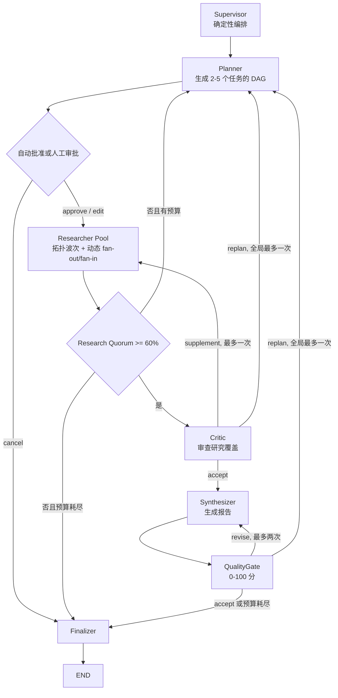

# Architecture

## v0.2 目标与边界

AtlasFlow v0.2 是一个面向工程展示的、可审计的多 Agent 深度研究系统。本版本先把 Agent
之间的职责、输入输出、并行调度、质量闭环和失败语义做正确；RAG 与 Tool 模块仍保留原有 API
和实现，但暂不进入研究主图，避免在编排协议尚未稳定时把外部能力耦合进来。

运行时没有 Mock 模式。生产容器只构造真实 OpenRouter provider；测试通过依赖注入使用
test doubles。LangSmith tracing 继续覆盖模型调用和工作流边界。

```text
Next.js UI
    │ HTTP + SSE
FastAPI API
    │
RunService ─────────────── InMemoryRunStore
    │                           │ Run / Event / Artifacts
LangGraph ResearchWorkflow ─────┘
    │
    └── ModelGateway
          ├── create_plan
          ├── analyze_task
          ├── review_research
          ├── synthesize_report
          ├── evaluate_report
          └── revise_report
                │
                └── OpenRouter Chat Completions

保留但未接入主图：ToolRegistry / HybridRetriever / Web Search / Calculator
```

## Agent 拓扑

六个逻辑 Agent 负责语义工作，Finalizer 只做确定性收尾，不算第七个 Agent：



Supervisor 不调用模型。它只初始化状态、选择确定性路由并记录原因。Planner、Researcher、
Critic、Synthesizer 和 QualityGate 通过 `ModelGateway` 调用真实 LLM。Researcher Pool 依据
计划依赖执行拓扑波次，同一波使用 LangGraph `Send` 动态展开，并用 semaphore 把实际并发限制
为 3。

## 结构化状态

主图状态持有显式版本化工件：

```text
run_id, query, auto_approve,
plan, plans[], research_results[], errors[],
critique_history[], draft_versions[], quality_history[],
route_history[], warnings[], metrics,
supplement_rounds, replan_count, revision_count,
report, requested_final_status, final_status
```

跨 Agent 数据都由 Pydantic 严格校验：`ResearchPlan`、`ResearchTask`、`ResearchResult`、
`CritiqueDecision`、`DraftVersion`、`QualityDecision`、`AgentError`、`RouteRecord` 和
`ExecutionMetrics`。模型无法用未声明字段悄悄改变协议。

## 计划、调度与并发

Planner 首次生成 2–5 个任务。每个任务包含稳定 ID、标题、目标、成功标准、优先级、依赖和
计划版本。`ResearchPlan` 在进入图前检查 ID 唯一、依赖存在、版本一致和无环。

调度器每轮只选取“所有依赖都已有成功结果”的任务，通过 `Send` 扇出 Researcher；本轮结果
合并后再计算下一波。单任务最多尝试两次，异常被转换为 `AgentError`，不会让一个分支异常直接
取消其他并行任务。实际并发受进程内 semaphore 限制，峰值写入
`ExecutionMetrics.peak_concurrency`。

研究成功率达到 60% 才能进入 Critic。部分任务失败但达到 Quorum 时允许继续，并在终态标记
`completed_with_warnings`；未达到 Quorum 时最多全局重规划一次，第二个计划仍未达到时结束为
`failed`。

## 质量闭环与有界预算

Critic 在写报告前检查研究覆盖和冲突，输出三类路由：

- `accept`：进入 Synthesizer；
- `supplement`：最多增加 2 个任务，且只允许一轮；单个计划累计最多 7 个任务；
- `replan`：生成下一版本计划，全局最多一次。

QualityGate 在报告生成后给出 0–100 分与问题列表：

- 只有分数至少 80 且没有 critical issue 才能 `accept`；
- `revise` 回到 Synthesizer，最多修订两次；
- `replan` 回到 Planner，和其他来源共享一次全局重规划预算；
- 质量预算耗尽时保留最新报告，以 `completed_with_warnings` 结束并暴露未解决问题。

所有循环都有硬上限，因此不会出现无限自我反思。

## Human-in-the-loop

`auto_approve=true` 是默认路径，但仍经过 approval node。`auto_approve=false` 时，图通过
LangGraph `interrupt()` 暂停，并由内存 checkpointer 保存状态。客户端可提交：

- `approve`：继续执行原计划；
- `edit`：提交编辑后的计划，重新执行完整 DAG 校验；
- `cancel`：确定性结束为 `cancelled`。

恢复必须使用同一 `run_id` 作为 LangGraph `thread_id`。当前 checkpointer 与 RunStore 都是
进程内实现，重启后的持久恢复属于后续数据库阶段。

## Run 生命周期与审计事件

Run 状态只有：`pending`、`running`、`waiting_approval`、`completed`、
`completed_with_warnings`、`failed`、`cancelled`。非法状态跳转由 RunStore 拒绝。

事件具有稳定字段：`sequence`、`event_id`、`run_id`、`event_type`、`agent`、`node`、
`task_id`、`plan_version`、`attempt`、`status`、`duration_ms`、`decision_reason`、
`created_at` 和 `data`。Store 在锁内分配连续 sequence；终态工件、状态和终态事件原子写入，
所以 SSE 一定先发送全部审计事件，再发送一次 `done`。

## Provider 与 LangSmith

`OpenRouterModelGateway` 对计划、研究结果、Critic 决策和质量决策使用严格 JSON Schema；
解析或契约失败时只做一次格式级重试。报告生成和修订返回纯 Markdown 文本。Provider 的网络、
限流和服务端错误仍由底层 client 做有限重试，认证或权限错误直接失败，不回退到本地结果。

每个网关方法都保留 LangSmith trace。`LANGSMITH_TRACE_CONTENT=false` 为默认值，只上传结构和
类型信息；显式设为 `true` 才上传查询、任务结果与报告正文。API key 不进入 Agent state。

## 当前阶段与后续演进

| v0.2 当前实现 | 后续阶段 |
|---|---|
| InMemoryRunStore + MemorySaver | PostgreSQL Run/Event repository + 持久 checkpointer |
| Researcher 仅调用 LLM | Context Provider 接口接回 RAG 与 Tool Registry |
| 进程内后台任务 | 队列、幂等 worker 与跨实例恢复 |
| 单进程 SSE | 可恢复消息流与跨实例事件分发 |
| 离线场景测试 | LangSmith Dataset、成本/延迟基线与在线回归 |

`/documents`、`/tools`、HybridRetriever 和内置工具仍可独立使用；它们不是本版本 Agent 主图
成功的隐含依赖，也不应在演示中声称已由 Researcher 自动调用。
